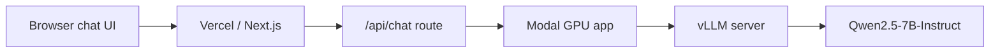

# Modal AI Chat

Self-hosted Qwen chat app using Modal for GPU inference, vLLM for model serving, and Next.js for the web UI.

## Screenshots

Screenshots will be added after the UI is finalized.

- Main chat view with sidebar history.
- Streaming response with Markdown and copyable code blocks.

## What This Demonstrates

- Streaming chat responses from a self-hosted open model.
- A server-side Next.js API proxy that keeps Modal credentials out of the browser.
- Modal GPU deployment with vLLM's OpenAI-compatible chat API.
- Persistent daily per-IP rate limiting with Upstash Redis.
- Cold-start-aware UX for serverless GPU inference.
- Settings drawer for system prompt, temperature, and max response length.
- Markdown rendering with copyable code blocks.
- Local browser chat history with a ChatGPT-style sidebar, delete, and clear controls.
- User-controlled streaming cancellation with partial response preservation.
- Response timing that shows when the model started responding and when it finished.

## Architecture



The browser only calls the Next.js API route. The Modal endpoint and API key stay on the server.

Request flow:

1. The browser sends chat messages to the Next.js `/api/chat` route.
2. The API route checks the daily IP limit.
3. The API route forwards the request to Modal using the server-side API key.
4. Modal runs vLLM on a GPU and streams tokens back.
5. The browser renders the streamed response as Markdown.
6. The user can stop generation from the browser, which aborts the active streaming request.

## Stack

- **Next.js**: chat UI and `/api/chat` proxy.
- **Vercel**: hosts the web app.
- **Modal**: runs the GPU-backed inference service.
- **vLLM**: serves Qwen through an OpenAI-compatible `/v1/chat/completions` API.
- **Qwen/Qwen2.5-7B-Instruct**: default model.
- **Upstash Redis**: stores daily rate-limit counters in production.

## Project Structure

```text
modal-backend/
  app.py              # Modal app that serves Qwen through vLLM
  requirements.txt

web/
  app/
    api/chat/route.ts # Server-side proxy to Modal
    page.tsx          # Chat UI
  .env.example
  package.json
```

## Features

- Streaming responses.
- Optional access-code gate to protect the Modal-backed API.
- Stop generating control for active streams.
- Settings drawer for system prompt, temperature, and max tokens.
- Model selector UI with Qwen2.5-7B configured.
- Markdown rendering for assistant responses.
- Copy buttons for full responses and individual code blocks.
- Retry action for the latest assistant response.
- Sidebar conversation history stored in the browser.
- Delete individual chats and clear local chat history.
- Daily 3-message-per-IP limit backed by Upstash Redis in production.
- Response timing display in plain language.
- Cold-start message while the Modal GPU wakes up.

## Generation Settings

The settings drawer lets you tune each chat without changing backend code:

- **System prompt** controls the assistant's behavior.
- **Temperature** controls response variety. Lower values are more focused; higher values are more creative.
- **Max tokens** caps response length. Lower values can reduce latency and GPU usage.

The API route validates these values before forwarding them to vLLM.

## Cold Starts

This project uses serverless GPU inference on Modal. If the Modal container has scaled down, the first request can take longer because Modal needs to start the GPU container and vLLM needs to load the model.

Current backend behavior:

```python
scaledown_window=5 * MINUTES
```

After a request, the Modal container stays warm for about 5 minutes. If the app is idle after that, it can scale down and the next request may cold start again.

## Cost Notes

The backend uses one Modal L4 GPU:

```python
gpu="L4:1"
```

Light usage may fit within Modal's monthly free credits, but GPU time can become billable. The app includes a small daily IP limit to reduce accidental spend.

Stop the Modal app when you are done testing:

```bash
cd modal-backend
python3 -m modal app stop qwen-vllm
```

## Modal Backend

Install and authenticate the Modal CLI:

```bash
python3 -m pip install modal
python3 -m modal setup
```

Create the API key secret used by vLLM:

```bash
cd modal-backend
python3 -m modal secret create qwen-api-key VLLM_API_KEY=change-me
```

Deploy the backend:

```bash
python3 -m modal deploy app.py
```

Current Modal endpoint:

```text
https://swarnakishoree--qwen-vllm-serve.modal.run
```

Use that URL as `MODAL_BASE_URL` in the web app.

## Web App

Run locally:

```bash
cd web
cp .env.example .env.local
npm install
npm run dev
```

Local app URL:

```text
http://localhost:3000
```

Required environment variables:

```text
MODAL_BASE_URL=https://swarnakishoree--qwen-vllm-serve.modal.run
MODAL_API_KEY=change-me
QWEN_MODEL=Qwen/Qwen2.5-7B-Instruct
UPSTASH_REDIS_REST_URL=change-me
UPSTASH_REDIS_REST_TOKEN=change-me
APP_ACCESS_CODE=change-me
```

`MODAL_API_KEY` must match the `VLLM_API_KEY` value stored in the Modal secret.

`UPSTASH_REDIS_REST_URL` and `UPSTASH_REDIS_REST_TOKEN` are used for persistent production rate limiting. If they are missing, the app falls back to an in-memory limiter for local development.

`APP_ACCESS_CODE` is optional. When set, the UI asks for the code before showing the chat and `/api/chat` rejects requests without it. Leave it unset for an open local demo.

## Deploying to Vercel

Create the Vercel project from the `web/` directory.

Recommended settings:

```text
Framework Preset: Next.js
Root Directory: web
Build Command: npm run build
Install Command: npm install
Output Directory: blank
```

Add the same environment variables listed above in Vercel.

Recommended first deploy:

1. Deploy `modal-backend/app.py` to Modal.
2. Copy the Modal endpoint URL.
3. Add the Vercel environment variables.
4. Deploy the `web/` app.
5. Send a test message through the UI.

## Development Notes

- The default model is `Qwen/Qwen2.5-7B-Instruct`.
- The backend starts on an L4 GPU for lower-cost testing.
- Model weights and vLLM artifacts are cached in Modal Volumes.
- Production rate limiting uses Upstash Redis. Local development can fall back to the in-memory limiter.
- `APP_ACCESS_CODE` is a lightweight sharing guard, not full user authentication.
- Chat history is intentionally browser-local through `localStorage`; it does not sync across devices.
- For broader public usage, add user auth, stronger request logging, moderation, and spend controls.
